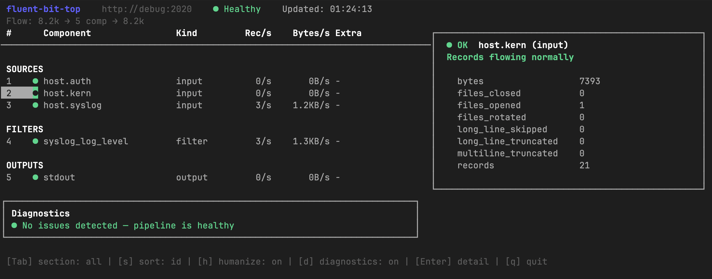

TUI-утилита для мониторинга и отладки пайплайнов [Fluent Bit](https://fluentbit.io/) в реальном времени.

Подключается к встроенному HTTP API Fluent Bit (порт 2020 по умолчанию), опрашивает `/api/v1/metrics` и отображает состояние каждого компонента пайплайна — входы, фильтры, выходы. Помимо метрик показывает **здоровье компонентов**, **скорость потока записей** и **панель диагностики**, которая автоматически находит проблемы в конфигурации и подсказывает, куда смотреть.

Разработан для быстрой отладки новых конфигураций Fluent Bit — вместо парсинга логов и ручного запроса к API всё собрано в одном терминальном окне с цветовой индикацией и контекстными подсказками.



## Панель диагностики

Панель диагностики анализирует метрики каждого компонента при каждом опросе и выводит список проблем с подсказками по конфигурации.

Каждый компонент получает один из статусов здоровья:

| Статус | Значение |
|--------|----------|
| `● OK` | Записи проходят нормально, ошибок нет |
| `▲ WARNING` | Есть ретраи, дропы или высокий процент отфильтрованных записей |
| `✖ ERROR` | Обработка завершается ошибкой (processing errors, failed retries) |
| `○ IDLE` | Записей нет — компонент простаивает, возможна ошибка в конфигурации |

Панель включена по умолчанию, переключается клавишей `d`.

### Примеры

```
✖ ERROR  12 processing errors [output.http]
         Check output endpoint: TLS certs, credentials, auth tokens
         Verify destination host is reachable: check DNS and firewall

○ IDLE   No records collected [input.tail]
         Check file path in input config — file may not exist or be empty
         Verify the input plugin is correctly configured (path, tag, parser)

▲ WARN   8 retries [output.elasticsearch]
         Transient failures occurred — monitor or increase retry_limit

▲ WARN   dropping >80% of records [filter.grep]
         Verify filter conditions — high drop rate may indicate misconfigured rules

○ IDLE   No records processed [output.s3]
         Upstream may be blocked — verify filters are not dropping all records
         Verify upstream input tags match the output match directive
```
